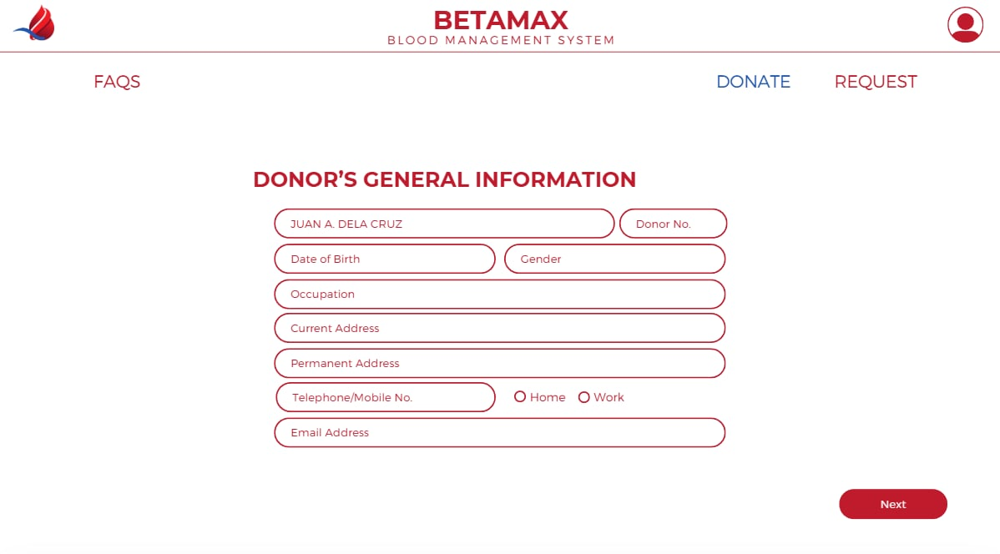
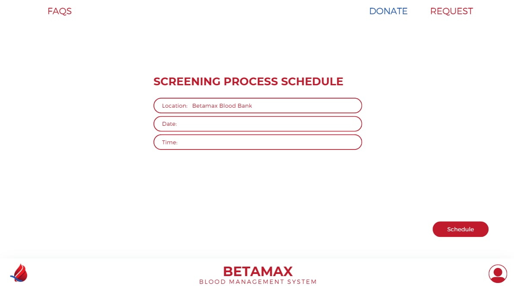
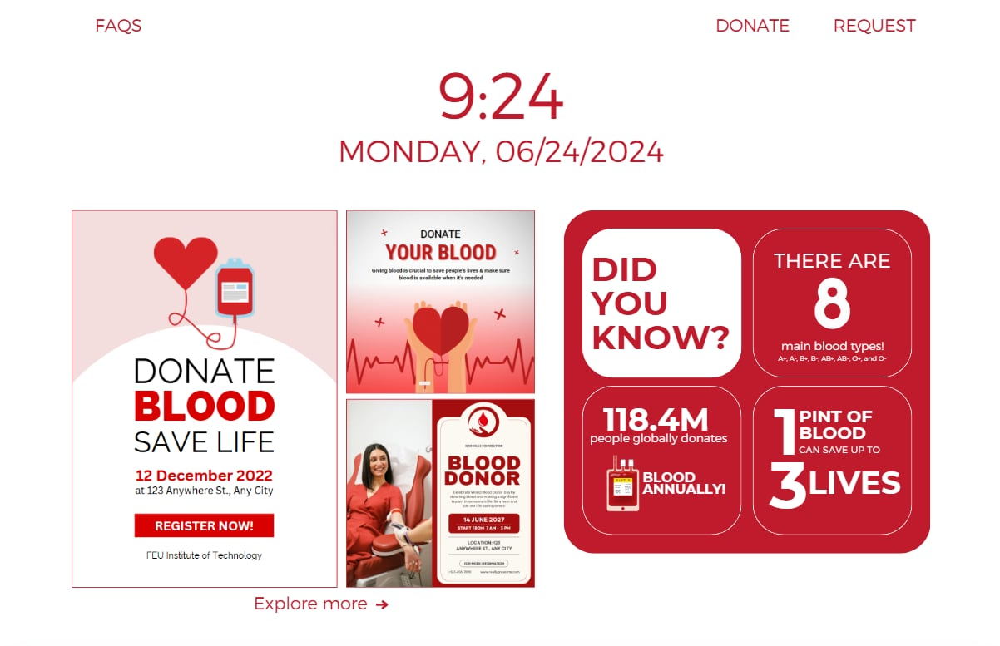
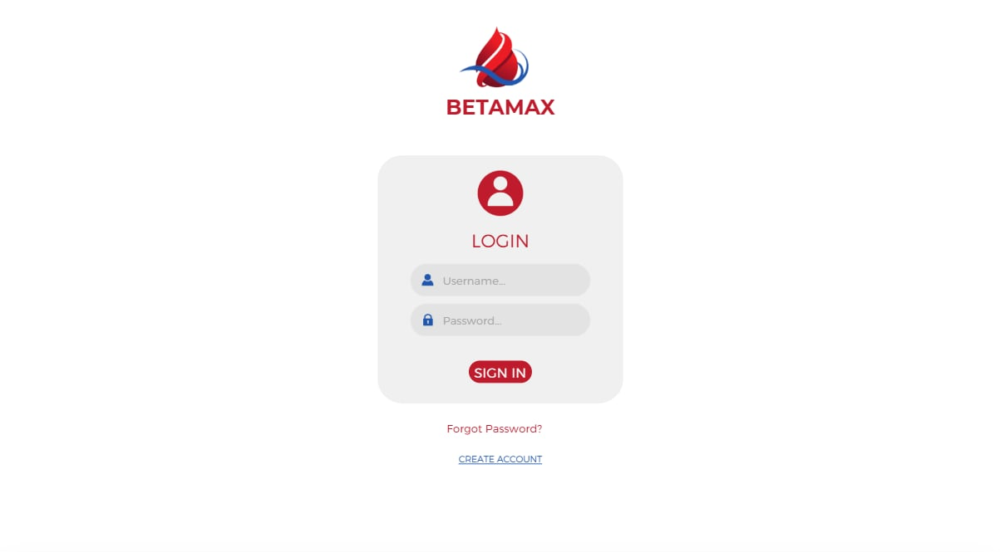

# BETAMAX Blood Bank Management System 🩸💻

## Group Members: 👥
- Sean Ray Bongansiso  
- Aizen Johann Calilan
- Jyke Jenfrey Gapasin
- Ivan Crisruf Malitao
- Lyka Mariel Villaflores

---

## Project Aim 🎯
The BETAMAX project is designed to revolutionize blood bank operations by creating a comprehensive and user-friendly web platform. Its primary goal is to streamline blood donation scheduling, blood request management, and overall blood supply monitoring to improve healthcare delivery in hospitals and clinics. BETAMAX aims to reduce administrative burdens, enhance communication between donors, recipients, and administrators, and ultimately contribute to saving more lives through efficient blood management.️‍🩹

---

## Usage and Features ⚙️
BETAMAX offers a robust platform tailored for various users including donors, recipients, and medical administrators. The key functionalities include:

- 🩸 **Donor Interface:** Enables donors to schedule blood donations, view their donation history, and update personal information.
- 🏥 **Recipient & Medical Institution Interface:** Allows medical institutions and recipients to request specific blood types, track request status, and manage blood supply needs.
- 📊 **Administrator Dashboard:** Provides a comprehensive overview of blood stocks, donor and recipient records, donation schedules, and transaction history for efficient management.
- 👤 **User Management:** Supports registration, profile updates, and secure access for different user roles.
- ⏱️ **Real-time Data Tracking:** Ensures timely updates on blood availability and requests.

The website leverages foundational web technologies: HTML for structure, CSS for styling, JavaScript for interactive features, PHP for server-side processing, and SQL for database management, delivering a seamless and accessible user experience.

---

## Visual Demonstrations 📸

### Homepage & Login Screen 🔑  

### Donation Scheduling Form 📅  

### Blood Request Submission Interface 📝  

### Administrator Dashboard Overview 📈  

*Screenshots are attached to provide a clear visual of the platform’s design and functionality.*

---

## Current Development Note 🔧  
While the initial version of BETAMAX was developed using fundamental web technologies such as HTML, CSS, and JavaScript, the project is currently undergoing updates to incorporate more advanced functionalities and modern frameworks. These improvements aim to enhance performance, security, responsiveness, and overall user experience. Future iterations will include better UI/UX design, integration with APIs, improved database interactions, and possibly mobile responsiveness to meet current digital standards.
